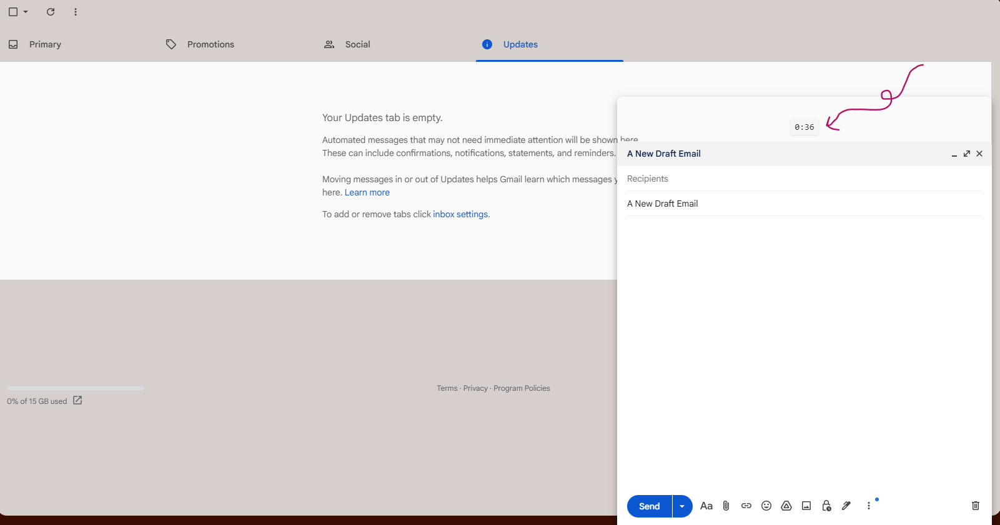
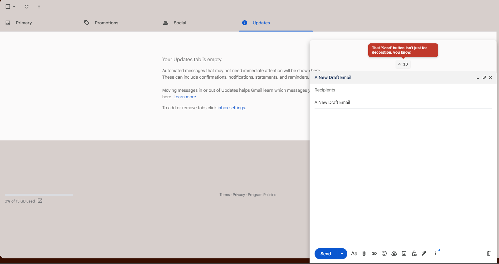
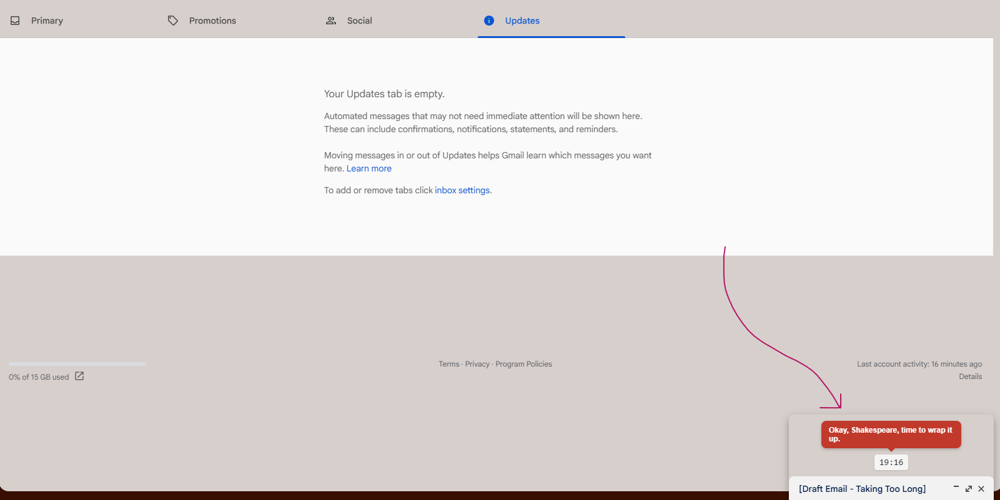

# Gmail Email Timer ⏱️

* **** **Get it on the Chrome Web Store:** Coming Soon! Still in Development 🚀

---

## What It Does

- This extension adds a timer to every new email draft you compose in Gmail.
- If you take very long, it roasts you to keep you on your toes! 😄
- In the future, it will allow you to see how long you spend on emails on average and show you trends over time. 
    - It will also track the number of times you've been roasted since installation 🔥

 

- This is a fun, light-hearted extension, not meant to shame anyone. Use it to improve your email habits, or just for laughs!

---

## Screenshots

*The timer starts as soon as you open a new draft:*

*Take too long, and the roasts begin...*

*You get a fresh roast every 2 minutes...until you send or discard*

---

## Features

* **Automatic Timer:** Starts a timer in the "New Message" header the moment you click "Compose".
* **Random Roasts:** Displays a random, humorous "roast" every few minutes to keep you on your toes.
* **Auto-Stop:** The timer stops and cleans up automatically when you send or discard the email.

---

## Known Limitations

This extension has a few key limitations:

* **DOM Dependence:** The extension is highly dependent on Gmail's specific HTML structure and CSS selectors. If Google updates its UI, this extension may break until it's manually updated to find the new selectors.
* **No Per-Draft Persistence:** It cannot currently track a single, persistent timer for each specific draft. If you close a draft (saving it for later) and go back to re-open it, the timer will reset to 0:00.

---

## Installation

### From the Chrome Web Store

- **Coming Soon!**

### For Local Development

If you want to load the extension from this source code:

1.  Download or clone this repository to your local machine.
2.  Open Google Chrome and navigate to `chrome://extensions`.
3.  Enable **"Developer mode"** (using the toggle in the top right).
4.  Click the **"Load unpacked"** button.
5.  Select the folder where you saved this project.
6.  Open (or refresh) Gmail, and you should see the timer when you click "Compose"!